# Global Doctors


## Introduction

Global Doctors is a blog about medical doctors who love to travel and work as locums all around the world with a jobboard for interested locum doctors. Global Doctors has been developed as part of the Code Institute's Full-Stack Developer course as my 4th project - focusing on Django and Bootstrap frameworks, Database manipulation and CRUD functionality.

View live site here : [Global Doctors](https://traveldoc-0a6dba7e37c3.herokuapp.com/)  
  
For Admin access with relevant sign-in information: [Global Doctors Admin](https://traveldoc-0a6dba7e37c3.herokuapp.com/admin/)

<hr>


## Overview

Global Doctors is a blog about medical doctors who love to travel and work as locums. Users are invited to:

- Join the Global Doctors community
- Create their own profiles, either as regular users or as employers
- Add and interact with articles
- Create and manage their job posts as employers or thier job applications as regualar users
- Discover more about working as a locum doctor around the world

Global Doctors is accessible via all browsers with full responsiveness on different screen sizes. Its aim is to create a safe, informed community of doctors who can interact and share with each other and learn from one another. I have created this site to meet the needs of the growing community of global doctors. In a world that is rapidly progressing globaly, there are more and more opportunities for doctors to explore the world and exercise thier profession.  Global Doctors aims to offer a starting point for creating a community of regular users and employers to facilitate communication and job opportunities. In future development of this project, I hope to offer the admin and users the chance to communicate via email. Other features will inlcude events and a funding section.


# UX - User Experience

## Design Inspiration


### Colour Scheme


 


### Font
  
# Project Planning  
 
## Strategy Plane

The project goal was to build an interactive blog with job board to connect interested users. I aimed to create an easy, uncomplicated job posting system for employers and job application process for interested doctors. Through planning and design prep work, I realised that there was an opportunity to treat this service like a 'brand' and develop the idea further. A social element was born from this with an idea for users, both employers and doctors to be able to share advice and images of their experiences on the website. This would hopefully help to create an informative and motivational group of users who would recommend the site to others, share articles outside of the core group, and attract more users to sign up. Following common social-media design trends, I planned to use icons, high-quality, photographic images and an attractive, connected colour scheme.

### Site Goals

- Create an informational and motivational environment for users
- Create a job board to connect interested users (i.e.Doctors) with potential employers
- Easy UI for quick fulfillment of feature CRUD functionalities
- UX remains the same whether on mobile, tablet or desktop
- Scalable idea, for addition of future features to easily grow the business

## Agile Methodologies - Project Management

Global Doctors is my first project following Agile planning methods. I used my [Github Projects Board](https://github.com/users/angelaanjorin/projects/3) to plan and document all of my work.

### MoSCoW Prioritization

I chose to follow the MoSCoW Prioritization method for Global Doctors, identifying and labelling my:

- **Must Haves**: the 'required', critical components of the project. Completing my 'Must Haves' helped me to reach the MVP (Minimum Viable Product) for this project early, allowing me to develop the project further than originally planned.
  
- **Should Haves**: the components that are valuable to the project but not absolutely 'vital' at the MVP stage. The 'Must Haves' must receive priority over the 'Should Haves'.
- **Could Haves**: these are the features that are a 'bonus' to the project, it would be nice to have them in this phase, but only if the most important issues have been completed first and time allows.
- **Won't Haves**: the features or components that either no longer fit the project's brief or are of very low priority for this release. 


## User Stories

User stories and features recorded and managed on [GitHub Projects](https://github.com/users/angelaanjorin/projects/3)


### Visitor User Stories

| User Story | Priority |
|----------------------------------------------------------------------------------------------------------------------------|---------------|
| As a site user I can view a paginated list of posts so that I can choose which post I want to view| **MUST HAVE** |
| As a site user/site admin I can view comments on an individual post so that ** I can read the conversation** | **MUST HAVE** |
| As a site user I can view a miximum of 6 posts in each category so that I have a good overview and can browse throught the pages | **MUST HAVE** |

### Epic - User Profile

| User Story | Priority |
|----------------------------------------------------------------------------------------------------------------------------|---------------|    
| As a Site User I can register an account so that I can comment on a post | **MUST HAVE** |
| As a User I want to be able to login and create a profile so that I can choose which user I am and what CRUD I want to do.| **MUST HAVE** |
| As a User I can register my account and create my profile so that I can comment and like posts and submit a post to be published| **MUST HAVE** |
| As a Regular User I can create a profile so that I can see all the jobs I have applied to and post that I have submitted that have been published and those awaiting approval| **MUST HAVE** |
| As a User I can specify on the signup what kind of user I am so that I have certain accessibility and function on the site | **MUST HAVE** |
| As an Employer I can create a profile so that I can see all the jobs I have published | **MUST HAVE** |
| As a user I can signup with my email address so that I can receive email replies from the website| **WONT HAVE** |


### Epic - Blog

| User Story | Priority |
|----------------------------------------------------------------------------------------------------------------------------|---------------|
| As a user I can view the different categories of the blog post so that I get an overview of the different posts.| **MUST HAVE** |
| As a User I can open a post so that I can read the content of the whole post on another page | **MUST HAVE** |
| As a site admin I can create, read, update and delete posts so that I can manage my blog content| **MUST HAVE** |
| As a logged in user I can create draft posts so that I can finish writing the content later | **MUST HAVE** |
| As a site user I can write comments on individual posts so that ** I can be part of the conversation** | **MUST HAVE** |
| As a logged in user I can like a post so that I can participate in showing my appreciation for the content of the post to others. | **SHOULD HAVE** |
| As a site user I can view the likes on a post so that I can be informed about the amout of likes on a post. | **SHOULD HAVE** |
| As a site user I can modify or delete my comment on a post so that I can be involved in the conversation. | **MUST HAVE** |
| As a regular user I can add a post so that I can share my story or experience | **MUST HAVE** |
| As a logged in site user I can use the post form so that I can submit a blog post for review and publication by the admin | **MUST HAVE** |
| As a logged in user I can write a post in a nice form so that I can contribute to the blog | **MUST HAVE** |
| As a site user (both regular und employer) I can modify or delete my post so that I can make changes if I want to. | **MUST HAVE** |

  
### Epic - Job

| User Story | Priority |
|----------------------------------------------------------------------------------------------------------------------------|---------------|
| As a user I can view all the jobs so that I can apply to a job if I qualify | **MUST HAVE** |
| As an Admin I can aprrove the job posts so that the jobs can be published on the site to seek applicants | **MUST HAVE** |
| As a site user I want to navigate to the about page to find out more information about the site. | **MUST HAVE** |
| As a site user I can view 6 jobs in each speciality per page so that I have a good overview of the jobs | **COULD HAVE** |
| As a regular user I can add a star rating to the jobs so that I can express my liking of the job.| **SHOULD HAVE** |
| As a Regular or employer user I can delete my job applications or job posts so that I have full control over my respective posts. | **MUST HAVE** |
| As an employer I can submit a job so that it is posted on the website | **MUST HAVE** |

### Epic - Job Application

| User Story | Priority |
|----------------------------------------------------------------------------------------------------------------------------|---------------|
| As a Regular User I can apply for a job so that I can eventually get the job | **MUST HAVE** |
| As a user I can use the application form so that I can apply for jobs | **MUST HAVe** |
| As a Regular user I can modify or delete my job applications so that I can make changes if I need to.| **MUST HAVE** |


### Epic - About - Contact

| User Story | Priority |
|----------------------------------------------------------------------------------------------------------------------------|---------------|
| As a Site User I can click on the About link so that I can read about the site | **MUST HAVE** |
| As a Site Admin I can create or update the about page content so that it is available on the site | **COULD HAVE** |
| As a site user I can get all the contact information I need so that I can contact the site owners. | **SHOULD HAVE** |
    
    
## Scope Plane

As this would be a dual learning/building project using technologies that were new to me, such as Django, SQL and Bootstrap, I was cautious to maintain consistent control over the scope of the project and not let my idea grow too big. With the sheer amount of files, I needed to lockdown my project features early on into manageable blocks so as not to lose track of the MVP. Following my learning of the Django MVT framework I was able to identify how to change the templated structure to produce different website features from my base HTML. This allowed me to build upon my original idea of 'Global Doctors blog' only, and to add a social experience around blog posts and shared images and also to add a job section with addes features. Following Agile Planning Methodologies, I added my issues on my [GitHub project board](https://github.com/users/angelaanjorin/projects/3).

Essential features of my project were:

- A striking, accessible website that fulfils user needs
- Responsive website for users of mobile, tablet and desktop devices
- User Authentication
- User Profile creation and editing
- Blog feature with full CRUD functionality
- Job board feature with full CRUD functionality for both employers and applicants
- Business details to inform the user

Planning my project thoroughly from the start allowed me to identify areas of importance for MVP completion and satisfaction of assessment criteria, and to balance them with the feasibility of the features.


## Structural Plane
To allow for ease of responsiveness, each section was designed keeping in mind the switch from 'row' to 'column' when moving from Desktop to Mobile/Tablet view. This approach allowed me to add more features to the project early on by reusing and repurposing sections of code.

## Skeleton & Surface Planes

### Wireframes


### Database Schema - Entity Relationship Diagram

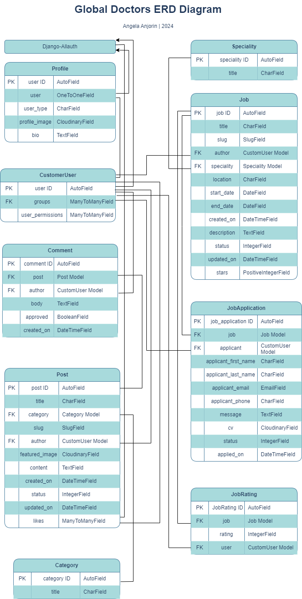  
*Database Schema (ERD) for Global Doctors displaying relationships between feature components saved within the database*

This Entity Relationship Diagram(ERD) demonstrates how each feature interacts with each other and the connected PostgreSQL Database. Using Django's User Model, and Django AllAuth to carry out all user authentication, a user has to choose whether they are an employer or regular user with specific CRUD functionality allowed to the different groups. A user_id is then created when the user registers with their username and email. This allows the user to edit a blank profile, create new blogs and add comments and in the case of employers create new jobs and in the case of regular users apply for the jobs and rate the jobs.

The Custom User Model and Profile Models were inspired by [Django for professionals 4.0](https://djangoforprofessionals.com/), Author: Williams S. Vincent.

Blogs and Comments Models were inspired by the blog walkthrough by the Code Institute. They helped me to get a good and secure grasp of the templating structure and connected Python files to push my features further, make them my own and then develop my Job and Jobapplication Models.

My Jobapplication Model collects data from the user about them and giving them the option of uploading a CV which is stored in Cloudinary. The Admin can check the applications and change the status from applied (default), to sent to employer, accepted and rejected. The applicant can view the status of thier application on thier profile. 

Through the Admin Django Dashboard, the connected user_id to all data entered to the site means that the Admin can remove a User and their data completely through the additon of on_delete=models.CASCADE. At the moment, a user can remove any data they share with the site, but they cannot delete their account completely. This feature will come in the next version.

### Security

A number of security steps were taken in this project in order to protect the user's submitted data. Unlike a strictly informative website, Global Doctors allows the user to become part of the community and avail of it's job board services. To meet the strict internet standards of protecting a user's data, the following processes were included in the project's development.

**AllAuth**  

Django AllAuth is an installable framework that takes care of the user registration and authentication process. Authentication was needed to determine when a user was registered or unregistered and it controlled what content was accessible on Global Doctors. The setup of AllAuth included:

- installing it to my workspace dependencies
- adding it to my INSTALLED_APPS in my settings.py
- sourcing the AUTHENTICATION_BACKENDS from the AllAuth docs for my settings.py
- adding its URL to my projects 'urls.py'
- run database migrations to create the tables needed for AllAuth
- (For this version of Global Doctors, to meet MVP, email and social accounts were not configured as part of the feedback/sign up options to the user. They will be included with the next release.)
  
**Defensive Design**  

FGlobal Doctors was developed to ensure a smooth user experience, to the best of my current learning experience with Django. 

- Input validation and error messages provide feedback to the user to guide them towards the desired outcome. 
- Unregistered users are diverted to the Sign Up page from restricted access pages. 
- Authentication processes control edit/delete icons to reveal them to the content author only. 
- Deletion of data is confirmed through an additional modal, double-checking with the user.
- Error page is displayed with 'Take me home' buttons to help users get back on track. 
- Testing and validation of features completes the process.

**CSRF Tokens** 

CSRF (Cross-Site Request Forgery) tokens are included in every form to help authenticate the request with the server when the form is submitted. Absence of these tokens can leave a site vulnerable to attackers who may steal a users data.
  

# Features

## User View - Registered/Unregistered

It was important to me from the beginning that Global Doctors be accessible to an unregistered user, in some capacitites. I wanted the website to attract a new user quickly by immediately inviting them into the community through the site´s about us information, blogs and especially the jobs section. The following is a breakdown of the site's accessibility for registered/unregistered users:

| Feature   | Unregistered User | Registered, Logged-In User |
|-----------|-------------------|-----------------|
| Home Page | Visable           | Visable         |
| Profile   | Not Visible - 'Profile' icon only appears for registered, logged-in users | Visable and full feature interaction available |
| Blogs  | Visable but not interactable via 'Likes/Comments', 'Add Post' button not visible | Visable and full feature interaction available |
| Jobs   | Jobs visible but redirected to Sign In page/Sign Up through link | Visable and full feature interaction available for applicants and job creation possible only to employers|
| About Us  | Visable and map interaction available | Visible and map interaction available |
| Contact   | Visible            | Visible
| Job application form | visible  | Visible only to regular user not employers
| Job Star Review | Visible     | Visible to both employer and regular user
| Review page(to make reviews) | Not visible | Visible only after applying to a job for the first time by an applicant


## CRUD Functionality

Users are able to Create, Read, Update and Delete their shared information on Global Doctors. Some features make full CRUD functionality available, whilst others present the necessary options only. Here is my CRUD breakdown for Global Doctors:

| Feature | Create | Read | Update | Delete |
|---------|--------|------|--------|--------|
| Profile | Created upon registration | Yes | Yes | Full Profile deletion is currently only available to Admin upon User Account deletion, the profile dashboard clears automatically if a user removes all of their posts, job applications for applicants and jobs for employers |
| Posts | Yes | Yes | Yes | Yes |
| Jobs(employers only) | Yes | Yes | Yes | Yes |
| Job Application(only for applicants/regular users) | Yes | Yes | Yes| Yes |
| Job review(only for applicants) | Yes(optional) | Yes | No | No

## Feature Showcase 
  
**Header/Navigation & Footer**

*For features showcase, screenshots of the features in use were taken on Laptop/samsung S10


**Home Page**
<details open>
    <summary> Home Page</summary>  
      
</details>

**Registration/SignUp**
<details open>
    <summary></summary>  
      
      
</details>

Users are required to add their Email(optional), Username and Password twice, to ensure the correct one is saved. If any field is not filled in appropriately then a display message is used to inform the user with how to procede to complete the form. The Register and Login pages are created with default templates available with the AllAuth package. These templates are combined with the power of Bootstraps Crispy Forms pack to give extra control over the forms' appearance.

**Login**

<details open>
    <summary> Login Page</summary>  
      
</details>

On successful login, the user is greeted with feedback through a message which confirms Login.  
  
*Login message*


  
*User is given feedback if they submit incorrect details where one item is correct and the other is incorrect*  


  
*Django built in field warnings for incorrect/forgotten fields input*  


**Logout**

<details open>
    <summary>Logout Page</summary>  
      
</details>
  
A user may choose to return to the Home page and stay logged in or leave the site, logged out.

  
*User is given feedback in message format to confirm sign out, Profile icon no longer visible in navigation bar - message disappears after 3 seconds*  

<hr>

**Profile**

<details open>
    <summary>Profile Page - Registered Users only- Employer Profile with Placeholder image for Profile</summary>  
      
</details>

<details open>
    <summary>Profile Page - Registered Users only- Regular User Profile after updated picture and bio</summary>  
      
</details>
  
The user profile is created upon registration and displays a placeholder image and 'Edit Profile' button to allow the user to personalise their view. With future releases this page will be accessible to other users and allow connection, currently it is only viewable to the user.
  
  
**Profile Edit**

<details>
    <summary>Edit Profile Modal</summary>  
      
</details>

An Edit Profile page appears once the edit button is clicked on the profile page allowing users to edit their Profile Picture, Display Name and Bio (for regular users/applicants).

<details>
    <summary>Edit Profile Modal</summary>  
      
</details>

<hr>

**Blog**

<details open>
    <summary>Blog Page - registered User View with category dropdownmenu, Unregistered User View with 'Add Post' icon (desktop)</summary>  
    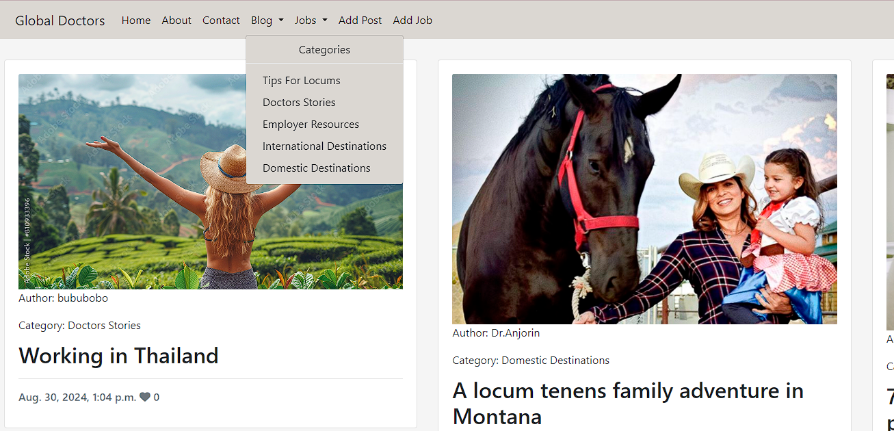 
    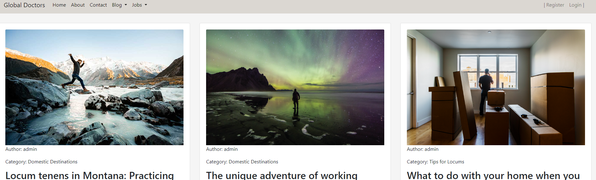 
</details>

<details>
    <summary>Blog- Category Page </summary>  
    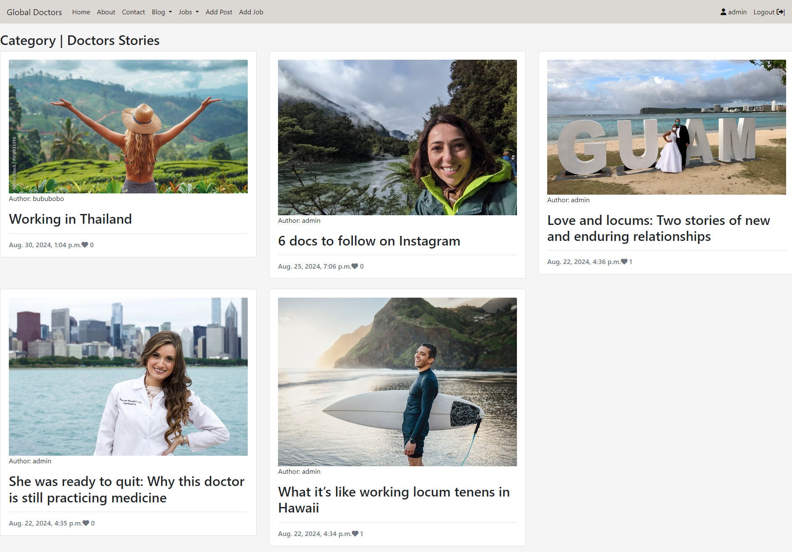  
</details>  

<details>
    <summary>Read Blog Page - Unregistered User View</summary>  
    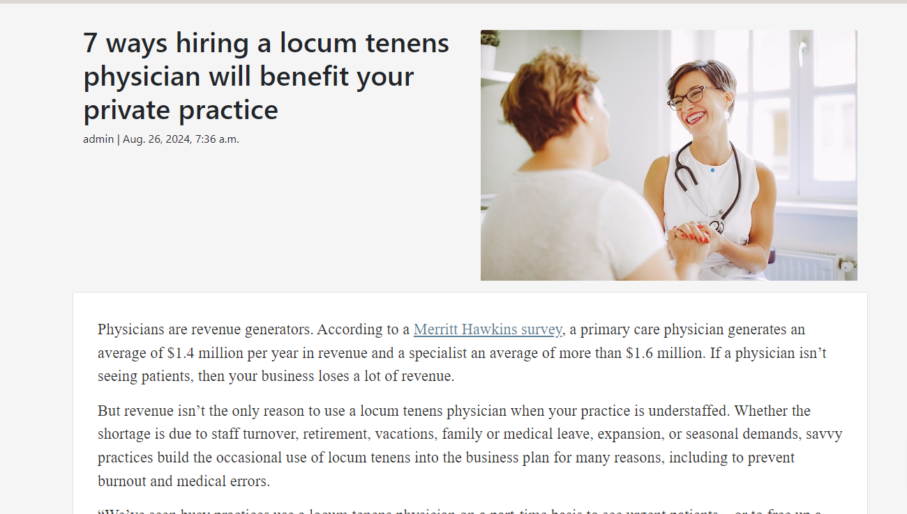  
</details>  
  
Unregistered Users have access to all blog posts available on Global Doctors. When registered and logged in, they may access the 'Add Post' button, 'Like/Unlike' icon and leave a comment. Articles created are displayed on individual 'cards' which display in rows for larger screens and columns for portrait, mobile view.

  
*Site pagination kicks in to display 6 posts per page. Buttons with next or prev at the base of the posts section allow users to move forward and back*  


Unregistered Users are free to read the articles and comments left on Global Doctors but they cannot 'Like/Comment' them until they have signed up and logged in. the comment section is a link to the signup page.

  
*A Likes and Comments counter is visible under every article. Logged-In Users can interact by clicking the heart outline to like. 'Heart outline' icon is replaced by filled Heart icon*  


  
*Likes icon is represented by an outlined heart icon. When it receives a like from the logged-in user, it becomes a filled heart icon and the user receives a success message,*  
  

<details open>
    <summary>Add a Comment - Registered User View</summary>  
      
</details>

A comment box is visible to logged-in users only. Their comment appears on the website once submitted and they can then edit or delete it. This is a better user experience as having to wait for approval from the admin. If there are any inappropriate comments, the admin can delete them via the admin panel.

  
*Comment is posted successfully message displayed after comment submit*
  

<details>
    <summary>Delete Comment - Registered User View for Comment Author only</summary>  
      
</details>

For the author of the comment, when logged in, a delete button will appear to allow them to delete the comment if they wish. 


**Create Blog Posts**

<details open>
    <summary>Add Post Page - Registered, Logged In User View</summary>  
      
</details>  
  
The user may create a post and include their own image or allow a placeholder image. Feedback is given to the user to guide them if they do not fill out the required sections appropriately. The Submit button saves the article for Admin approval. Once approved, the article will appear on the main page.  In thier profile the user can edit and delete thier posts irrespective of draft or published status.
  

<details>
    <summary>Placeholder image for Posts</summary>  
      
</details>


  
*Admin approval is required for posts to keep FGlobal Doctors on topic. Feedback is provided to the user by message that the post is awaiting approval*


**Edit Post**

<details open>
    <summary>Edit Post Page - Registered, Logged In User View - post Author View - Edit/Delete buttons</summary>  
      
</details>

<details>
    <summary>Edit Post Page - Only accessible to the Post Author</summary>  
      
</details>
  
If a user spots a typo, error or wants to add new information to their posts, then they may edit the post and submit for immediate reposting. A certain amount of trust exists between Admin and the Global Doctors community to hope that no inappropriate or off-topic content will be shared, which will result in an immediate deletion of the user's account by the Admin. These issues will be locked down in the future development of Global Doctors to allow certain content/words to be flagged and removed by the Admin or not allow the form to be submitted in the first place. Community guidelines will also be developed.

<details>
    <summary>Edit Post Message</summary>  
      
</details>


**Delete Post**

<details>
    <summary>Delete Post - Only accessible to the Post Author </summary>  
    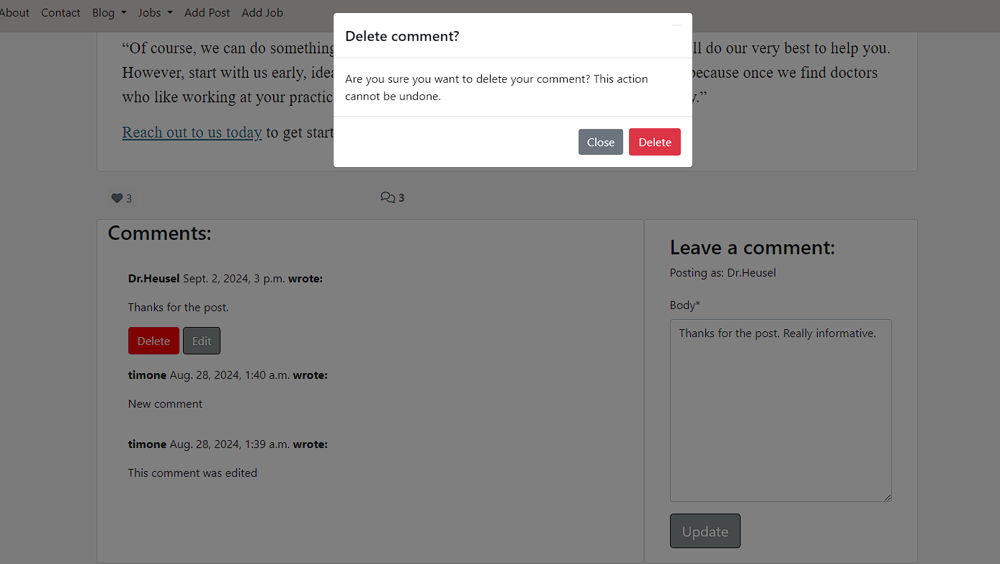  
</details>

  
*User is informed that their article has been deleted - message disappears after 3 seconds*


<hr>

**Jobs**

<details open>
    <summary>Add Job Page - Registered, logged-in Employer Users only</summary>  
      
</details>
  
  
*User is informed that their article has been deleted - message disappears after 3 seconds*

For creating a job, the user is informed of the necessary fields to be filled in via feedback. Speciality is selectable via a dropdown menu. In the future authors can create new specialities if they need to. Start Date and End date are selectable for the duration of the jobs via a calendar widget. Neither dates can be in the past and the end date can´t be before the start date. A summornote widget is provided for the Job Description.

  
*Warning shown to Users if they choose a date in the past.*  
 
  
  
*If a end date is before the start date then the user is informed via warning message.


  
*User feedback is delivered by message once a job has been submitted through creation or edit- message disappears after 3 seconds*

<details open>
    <summary>Jobdetail Page</summary>  
    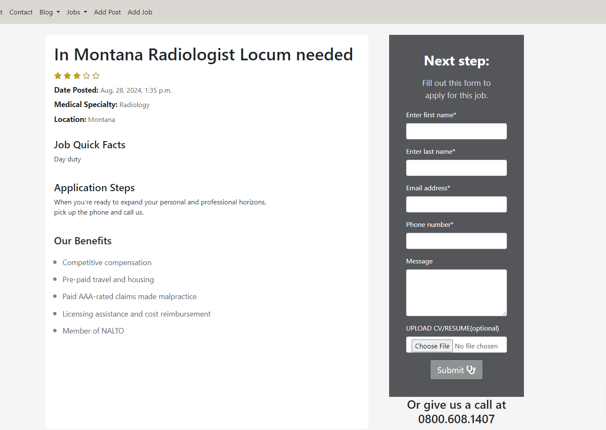  
</details>

**Delete Job**

<details>
    <summary>Delete Job - Only accessible to the Job Author </summary>  
      
</details>

  
*User is informed that their job has been deleted - message disappears after 3 seconds*


**Edit Job**

<details>
    <summary>Edit Job Page - Only accessible to the Job Author </summary>  
      
</details>

  
*User is informed that their job has been successfully edited - message disappears after 3 seconds*

<hr>

<details>
    <summary>Job Speciality dropdown menu</summary>  
    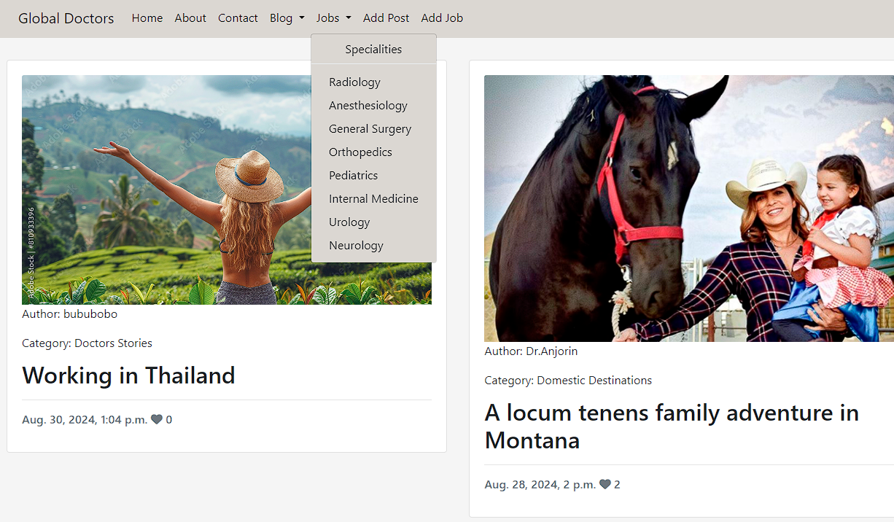  
</details>


<details>
    <summary>All Jobs in a Speciality- Paginated by 9</summary>  
    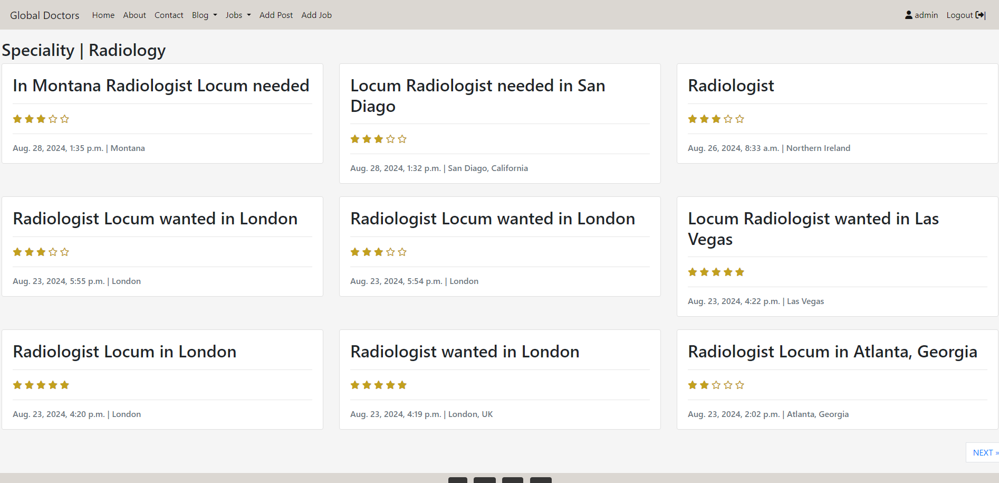  
</details>

**Job Application**

<details open>
    <summary>Job Application- Registered, logged-in Regular Users only</summary>  
      
    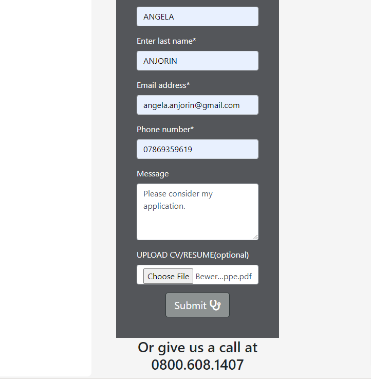  
</details>
  
  
*User is informed that their ajob application has been submitted - message disappears after 3 seconds*

For applying to a job, the user is informed of the necessary fields to be filled in via feedback. The email address has to be a correct email address with the @ sign.
They need to leave a short message to the employer. Adding thier CV as a file document is optional.
After pressing the submission button they are redirected to a job review page.

<details open>
    <summary>Job Review Page- Only Job applicants after their first job application</summary>  
      
</details>
The applicant is asked to review the job with a staring system between 1-5. They are then redirected to the home page. Reviewing is optional, they can click away. 
In the background the highest amount of stars (5) given to a job is updated and shown to all users, even non registered users. Employers can not delete or edit the star reviews. 

**Edit Job Application**

<details>
    <summary>Edit Job Application - Only accessible to the Job Applicant on their profile page</summary>  
      
</details>

  
*User is informed that their job application has been successfully edited - message disappears after 3 seconds*
The status of thier job applications returns to applied after every update, so that the admin can review the changes and forward the updated application to the employers.

**Delete Job Application**

<details>
    <summary>Delete Job Application - Only accessible to the Job Applicant on their profile page</summary>  
      
</details>
  
A user may delete thier job application.

  
*User feedback is delivered by message once a job application has been deleted - message dissappears after 3 seconds*


**About Us**

<details>
    <summary>About Us Page</summary>  
    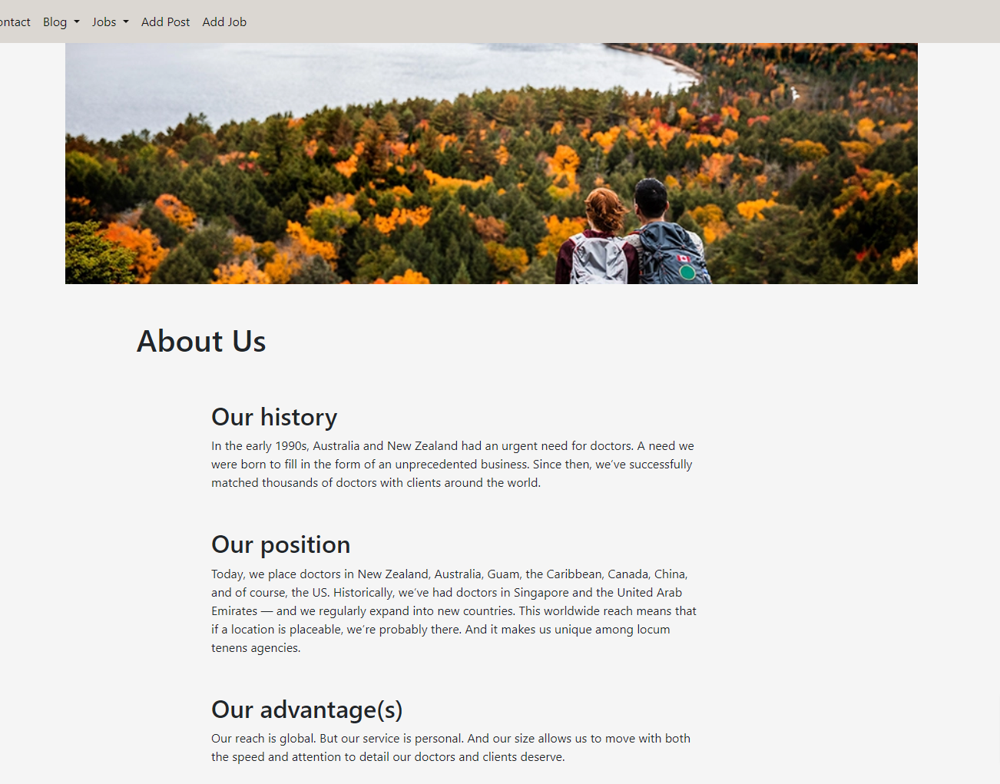  
</details>
  
This page offers the user business information including clickable telephone numbers and email address as well as the physical address. An embedded interactive Google Map allows the user to see Global Doctor's office location without leaving the site. 

**Contact**

<details>
    <summary>Contact</summary>  
      
</details>

This page offers the user business information including clickable telephone numbers and email address as well as the physical address. In addition there is a form for any user to fill out if they have enquires and are not yet ready to signup. Registered users can also use the form to send direct messages to the admin or site owners. In future iterations of the site, full email functionality will be added to this feature.

<hr>

**403, 404, 500 Pages**

These templates were added to this project in order to give the user the functionality to return to the website by using the links in the navigation bar or the Back to Homepage button on the Error page.


- They are triggered when a user tries to access:
  - information that is not theirs - 403,
  - information that does not exist anymore - 404,
  - something has gone wrong with the server and cannot retrieve database - 500

**Admin Panel**

Through Django's built-in Administration Panel, the Admin has full access over the data submitted to the website by registered Users. To access the Admin panel the Admin user adds '/admin/' to the end of the URL to display [https://traveldoc-0a6dba7e37c3.herokuapp.com/admin/](https://traveldoc-0a6dba7e37c3.herokuapp.com/admin/). A username and password is requested. For Global Doctors, Admin approval is needed for blog posts to keep the site on topic and to prevent spamming. Registered, logged-in users' have instant access to add a pcomment and like/unlike posts. Additionally employers when logged in can add jobs and have full CRUD functionality over thier job posts. Applicatns once logged in can submit job Applications with full CRUD functionality and also optionally submit a review of the job whcih can be read or optionally created but not deleted or updated. Those features will be added in the future. 

  
*Django Admin panel view for Global Doctors Administrator - content selection menu on left hand side*  


Users posts require approval by the Admin of Global Doctors to keep the website content on topic. Admin can change the status of articles from 'Draft' to 'Published'.

<details>
    <summary>Dropdown menu allowing Admin to 'publish' a users post, 'Save' button must be clicked to confirm</summary>  
      
</details>  

    

Admin can control users comments via the Django Admin panel.  

<details>
    <summary>All comments are made available to the Admin</summary>  
      
</details>


## Future Features

- **Email frontend functionality for Admin**: A frontend functionality for the Admin to send emails, without haviing to go to the admin panel.
- **Social account login**: Allowing popular social account login to the Golobal Doctors site will speed up the registration process.
- **Using Email to change passwords and to validate email addresses**: I did investigate this feature but encountered problems with gitpod preventing outbound functionality of external email providers like gmail or mailgun.
- **Using email and an email provider like gmail or mailgun to automatically send emails**: This feature is very important and will make immensely help the process of managing the site. 
- **Create an Event manager section of the site**: The Community could share upcoming events involving locum doctors or other interesting events for doctors and employers. Global Doctors could host an Event and have a booking system for key talkers at the event or allow participation from members for different aspects of organizing the event.
- **Funding is a big issue**: I would like to utilise the website to connect doctors who want to work locum around the world with funding programms so that they can fulfill thier dreams.


# Technologies Used

## Language Used

* HTML
* CSS
* JavaScript
* Python

## Frameworks - Programs Used

* [Git](https://git-scm.com/)
    * Git was used for version control by utilizing the Gitpod terminal to commit to Git and Push to GitHub.
* [GitHub:](https://github.com/)
    * GitHub is used to store the project's code after being pushed from Git.
* [GitHuv](https://derlin.github.io/bitdowntoc/)
    * This link was used to create the table of contents for the README file.
* [Gitpod](https://gitpod.io/)
    * Gitpod was used to write my code.
* [Draw.io:](https://app.diagrams.net/)
    * Draw.io was used to draw the ERD Diagram.
* [Favicon](https://favicon.io/) 
    * Favicon was used for converting the stethoscope icon into a favicon.
* [Cloudinary:](https://cloudinary.com/)
    * Images and future images and files uploads can be stored here.
* [Heroku:](https://heroku.com/)
    * Heroku was used to deploy the project.
* [Django](https://www.djangoproject.com/) 
    * Django was used as the Python framework for the site.
* [Code Institute´s PostgreSQL](https://dbs.ci-dbs.net/) 
    * This was used to host the PostgreSQL database needed to collect and recall the users data.


## Libraries 

- asgiref==3.8.1
- cloudinary==1.36.0
- crispy-bootstrap5==0.7
- dj-database-url==0.5.0
- dj3-cloudinary-storage==0.0.6
- Django==4.2.14
- django-allauth==0.57.2
- django-ckeditor==6.7.1
- django-crispy-forms==2.3
- django-js-asset==2.2.0
- django-resized==1.0.2
- django-summernote==0.8.20.0
- gunicorn==20.1.0
- oauthlib==3.2.2
- psycopg2==2.9.9
- PyJWT==2.9.0
- python-slugify==8.0.4
- python3-openid==3.2.0
- requests-oauthlib==2.0.0
- sqlparse==0.5.1
- text-unidecode==1.3
- urllib3==1.26.19
- whitenoise==5.3.0
  
Further information is available in the [requirements.txt file](requirements.txt)


# Testing

- For all testing, please refer to the [TESTING.md](TESTING.md) file.

# Deployment
  
## Connecting to GitHub  

To begin this project from scratch, you must first create a new GitHub repository using the [Code Institute's Template](https://github.com/Code-Institute-Org/ci-full-template). This template provides the relevant tools to get you started. To use this template:

1. Log in to [GitHub](https://github.com/) or create a new account.
2. Navigate to the above CI Full Template.
3. Click '**Use this template**' -> '**Create a new repository**'.
4. Choose a new repository name and click '**Create repository from template**'.
5. In your new repository space, click the green dropdown button and choose gitpod (if this is your IDE of choice) to generate a new workspace.

## Django Project Setup

1. Install Django and supporting libraries: 
   
- ```pip3 install 'django<4' gunicorn```
- ```pip3 install dj_database_url psycopg2```
- ```pip3 install dj3-cloudinary-storage```  
  
2. Once you have installed any relevant dependencies or libraries, such as the ones listed above, it is important to create a **requirements.txt** file and add all installed libraries to it with the ```pip3 freeze --local > requirements.txt``` command in the terminal.  
3. Create a new Django project in the terminal ```django-admin startproject freefido .```
4. Create a new app eg. ```python3 mangage.py startapp booking```
5. Add this to list of **INSTALLED_APPS** in **settings.py** - 'booking',
6. Create a superuser for the project to allow Admin access and enter credentials: ```python3 manage.py createsuperuser```
7. Migrate the changes with commands: ```python3 manage.py migrate```
8. An **env.py** file must be created to store all protected data such as the **DATABASE_URL** and **SECRET_KEY**. These may be called upon in your project's **settings.py** file along with your Database configurations. The **env.py** file must be added to your **gitignore** file so that your important, protected information is not pushed to public viewing on GitHub. For adding to **env.py**:

- ```import os```
- ```os.environ["DATABASE_URL"]="<copiedURLfrom Code Institutes PostgreSQL>"```
- ```os.environ["SECRET_KEY"]="my_super^secret@key"```
  
For adding to **settings.py**:

- ```import os```
- ```import dj_database_url```
- ```if os.path.exists("env.py"):```
- ```import env```
- ```SECRET_KEY = os.environ.get('SECRET_KEY')``` (actual key hidden within env.py)  

9. Replace **DATABASES** with:

```
DATABASES = {
    'default': dj_database_url.parse(os.environ.get("DATABASE_URL"))
  }
```

10. Set up the templates directory in **settings.py**:
- Under ``BASE_DIR`` enter ``TEMPLATES_DIR = os.path.join(BASE_DIR, ‘templates’)``
- Update ``TEMPLATES = 'DIRS': [TEMPLATES_DIR]`` with:

```
os.path.join(BASE_DIR, 'templates'),
os.path.join(BASE_DIR, 'templates', 'allauth')
```

- Create the media, static and templates directories in top level of project file in IDE workspace.

11. A **Procfile** must be created within the project repo for Heroku deployment with the following placed within it: ```web: gunicorn traveldoc.wsgi```
12. Make the necessary migrations again.

## Cloudinary API 

Cloudinary provides a cloud hosting solution for media storage. All users uploaded images in the FreeFid project are hosted here.

Set up a new account at [Cloudinary](https://cloudinary.com/) and add your Cloudinary API environment variable to your **env.py** and Heroku Config Vars.
In your project workspace: 

- Add Cloudinary libraries to INSTALLED_APPS in settings.py 
- In the order: 
```
   'cloudinary_storage',  
   'django.contrib.staticfiles',  
   'cloudinary',
```
- Add to **env.py** and link up with **settings.py**: ```os.environ["CLOUDINARY_URL"]="cloudinary://...."``` 
- Set Cloudinary as storage for media and static files in settings.py:
- ```STATIC_URL = '/static/'```
```
  STATICFILES_STORAGE = 'cloudinary_storage.storage.StaticHashedCloudinaryStorage'  
  STATICFILES_DIRS = [os.path.join(BASE_DIR, 'static'), ]  
  STATIC_ROOT = os.path.join(BASE_DIR, 'staticfiles')‌  
  MEDIA_URL = '/media/'  
  DEFAULT_FILE_STORAGE = 'cloudinary_storage.storage.MediaCloudinaryStorage'
```

## PostgreSQL

A new database instance can be created on [Code Institute´s PostgreSQL](https://dbs.ci-dbs.net/) or your database provider of choice for your project. 
- From your user dashboard, retrieve the important 'postgres://....' value. Place the value within your **DATABASE_URL**  in your **env.py** file and follow the below instructions to place it in your Heroku Config Vars.


## Heroku deployment

To start the deployment process , please follow the below steps:

1. Log in to [Heroku](https://id.heroku.com/login) or create an account if you are a new user.
2. Once logged in, in the Heroku Dashboard, navigate to the '**New**' button in the top, right corner, and select '**Create New App**'.
3. Enter an app name and choose your region. Click '**Create App**'. 
4. In the Deploy tab, click on the '**Settings**', reach the '**Config Vars**' section and click on '**Reveal Config Vars**'. Here you will enter KEY:VALUE pairs for the app to run successfully. The KEY:VALUE pairs that you will need are your: 
   
   - **CLOUDINARY_URL**: **cloudinary://....** 
   - **DATABASE_URL**:**postgres://...** 
   - **DISABLE_COLLECTSTATIC** of value '1' (N.B Remove this Config Var before deployment),
   -  **PORT**:**8000**
   -  **SECRET_KEY** and value  
  
5. Add the Heroku host name into **ALLOWED_HOSTS** in your projects **settings.py file** -> ```['herokuappname', ‘localhost’, ‘8000 port url’].```
6. Once you are sure that you have set up the required files including your requirements.txt and Procfile, you have ensured that **DEBUG=False**, save your project, add the files, commit for initial deployment and push the data to GitHub.
7. Go to the '**Deploy**' tab and choose GitHub as the Deployment method.
8. Search for the repository name, select the branch that you would like to build from, and connect it via the '**Connect**' button.
9.  Choose from '**Automatic**' or '**Manual**' deployment options, I chose the 'Manual' deployment method. Click '**Deploy Branch**'.
10. Once the waiting period for the app to build has finished, click the '**View**' link to bring you to your newly deployed site. If you receive any errors, Heroku will display a reason in the app build log for you to investigate. **DISABLE_COLLECTSTATIC**  may be removed from the Config Vars once you have saved and pushed an image within your project, as can **PORT:8000**.

## Clone project

A local clone of this repository can be made on GitHub. Please follow the below steps:

1. Navigate to GitHub and log in.
2. The [travel-doc Repository](https://github.com/angelaanjorin/travel-doc) can be found at this location.
3. Above the repository file section, locate the '**Code**' button.
4. Click on this button and choose your clone method from HTTPS, SSH or GitHub CLI, copy the URL to your clipboard by clicking the '**Copy**' button.
5. Open your Git Bash Terminal.
6. Change the current working directory to the location you want the cloned directory to be made.
7. Type `git clone` and paste in the copied URL from step 4.
8. Press '**Enter**' for the local clone to be created.
9. Using the ``pip3 install -r requirements.txt`` command, the dependencies and libraries needed for FreeFido will be installed.
10. Set up your **env.py** file and from the above steps for Cloudinary and ElephantSQL, gather the Cloudinary API key and the Elephant SQL url for additon to your code.
11. Ensure that your **env.py** file is placed in your **.gitignore** file and follow the remaining steps in the above Django Project Setup section before pushing your code to GitHub.

## Fork Project

A copy of the original repository can be made through GitHub. Please follow the below steps to fork this repository:  

1. Navigate to GitHub and log in.  
2. Once logged in, navigate to this repository using this link [travel-doc Repository](https://github.com/angelaanjorin/travel-doc).
3. Above the repository file section and to the top, right of the page is the '**Fork**' button, click on this to make a fork of this repository.
4. You should now have access to a forked copy of this repository in your Github account.
5. Follow the above Django Project Steps if you wish to work on the project.

# Credits

## Information Sources/Resources

* [Git tower](https://www.git-tower.com/learn/git/commands/git-rm).
* [Python](https://www.python.org/).
* [gspread](https://www.gspread.org/).
* [Code Institute](https://learn.codeinstitute.net/).
* [Stack Overflow](https://stackoverflow.com/).


## Code and Content

* Code Institute "I think therefore I blog" walkthrough helped me understand and setup the base code for Global Doctors.

* Posts and images are from <a href="https://gmedical.com/blog/" target="_blank"><strong>Global Medical Staffing</strong></a>

* I got additional inspiration from the following :
    1. [Portfolio Project 4 by Madeleine2086](https://github.com/madeleine2086/pp4)
    5. [Portfolio Project 4 by Amy Richardson](https://github.com/amylour/FreeFido_v2)


## Additional reading/tutorials/books/blogs

- [Django for professionals 4.0](https://djangoforprofessionals.com/), Author: Williams S. Vincent.
- [Django Docs](https://www.djangoproject.com/)
- [Bootstrap Docs](https://getbootstrap.com/docs/5.3/getting-started/introduction/)
- [Code Institute's](https://github.com/Code-Institute-Org>) I Think Therefore I Blog
- [Django save method](https://docs.djangoproject.com/en/4.2/ref/models/instances/) in models.py  
- [Django custom user model](https://learndjango.com/tutorials/django-custom-user-model) Creating New Users 
- [Advanced User Profile creation using allauth/signals](<https://dev.to/thepylot/create-advanced-user-sign-up-view-in-django-step-by-step-k9m)
- [Override Django's save method](https://www.sankalpjonna.com/learn-django/how-to-override-the-save-method-in-your-django-models)
- Find the [parent form element](https://www.geeksforgeeks.org/difference-between-dom-parentnode-and-parentelement-in-javascript/) of delete confirm button
- [Django cleaned data how to](https://overiq.com/django-1-10/django-form-basics/?utm_content=cmp-true)
- [ERD with draw.io](https://medium.com/@macaulaymercy1/how-to-create-an-erd-diagram-using-draw-io-a5267c85d788)

# Acknowledgements
 * Thanks to my Mentor Gareth McGirr for his assistance throughout the project.
 * Special thanks to my partner and alumni of Code Institute Eric Jones for his assistance throughout this project.

  